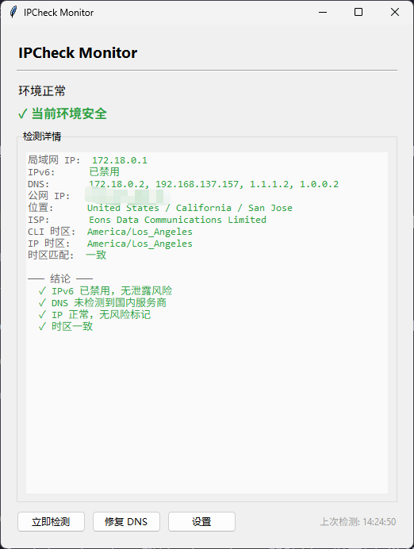
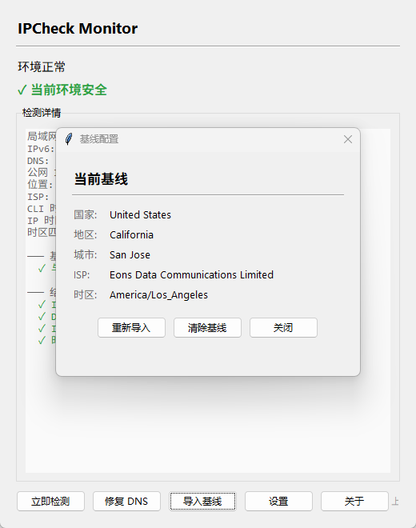

# IPCheck Monitor

Windows 系统托盘网络环境监控工具，基于 [ai-ipcheck](https://github.com/stormzhang/ipcheck) 实现后台定时检测，异常时自动弹窗提醒。

使用 Claude Code、OpenAI API、Cursor 等 AI 工具时，IPv6 泄露、DNS 暴露、IP 风控、时区不一致都会导致连接异常甚至封号。`ipcheck` 提供了一次性诊断能力，而 IPCheck Monitor 将它变成**常驻后台的实时监控**——你不需要反复手动跑命令，有问题它会主动告诉你。





## 检测项

| 检测项 | 正常 | 异常告警 |
|--------|------|----------|
| IPv6 | 已禁用 | 检测到 IPv6 地址，存在泄露风险 |
| DNS | 非国内服务商 | 使用国内 DNS，可能暴露真实位置 |
| IP 风险 | 风险评分低 | 风险评分中/高，建议更换节点 |
| 时区 | 本地时区与 IP 所在地一致 | 时区不匹配，可能触发风控 |

## 功能特性

- **系统托盘常驻** — 启动后最小化到托盘，不占桌面空间
- **定时自动检测** — 默认 40 秒一轮，间隔可配置（最小 10 秒）
- **三色状态指示** — 托盘图标绿/黄/红，一眼看出网络状态
- **异常弹窗通知** — 检测到问题时 Windows 系统通知弹窗提醒
- **一键修复 DNS** — 检测到国内 DNS 时弹窗询问，一键切换为 Cloudflare 安全 DNS
- **基线对比** — 导入当前位置/ISP/时区为基线，切换网络后自动对比并托盘通知
- **详情窗口** — 双击托盘图标查看完整检测结果
- **设置面板** — 检测间隔、网卡、DNS 服务器、时区均可自定义
- **自动提权** — 启动时检测管理员权限，非管理员自动弹 UAC 提权
- **单实例保护** — Windows Named Mutex 确保只运行一个实例

## 注意事项

### 管理员权限

程序启动时会自动请求管理员权限（弹出 UAC 确认框）。**修复 DNS 功能必须以管理员身份运行**，否则 `netsh` 命令无法修改系统网络配置。如果拒绝提权，检测功能正常但 DNS 修复会失败。

### 时区设置

使用代理/VPN 时，**本地时区必须和节点所在地一致**，否则会被风控系统识别。例如节点在美西（洛杉矶、旧金山、圣何塞），时区应设为 `America/Los_Angeles`。

操作路径：主窗口 → 设置 → 时区 → 选择对应时区 → 点击「应用」。

> 切换节点后记得同步修改时区，否则程序会持续告警「时区不一致」。

### DNS 设置

国内 DNS（如 114.114.114.114、阿里 DNS）会暴露你的真实地理位置，即使挂了代理也会被识别。程序检测到国内 DNS 时会弹窗提示一键修复，自动切换为 Cloudflare 安全 DNS（1.1.1.2 / 1.0.0.2）。

如需自定义 DNS，可在设置面板中修改。

## 快速开始

### 方式一：下载 exe（推荐）

前往 [Releases](https://github.com/restarthua/ipcheck-monitor/releases) 下载最新版 `IPCheckMonitor.exe`，双击运行即可，无需安装 Python 环境。

### 方式二：直接运行

```bash
pip install -r requirements.txt
python app.py
```

### 方式三：打包为 exe

```bash
pip install pyinstaller
build.bat
```

产出 `dist/IPCheckMonitor.exe`，双击即可运行，无需 Python 环境。

## 设置说明

点击主窗口底部「设置」按钮：

| 配置项 | 默认值 | 说明 |
|--------|--------|------|
| 检测间隔 | 40 秒 | 自动检测周期，最小 10 秒 |
| 网卡名称 | WLAN | DNS 修复时操作的网卡 |
| 主 DNS | 1.1.1.2 | Cloudflare for Families |
| 备 DNS | 1.0.0.2 | Cloudflare for Families |
| 时区 | （空） | IANA 格式，如 `America/Los_Angeles` |

配置保存在同目录 `config.json`，重启后自动加载。

## 项目结构

```
app.py              主程序：窗口 + 托盘 + 定时检测 + 通知
checker.py          ai-ipcheck 库封装，返回结构化检测结果
config.json         运行时配置（自动生成，不进 git）
build.bat           一键 PyInstaller 打包脚本
IPCheckMonitor.spec PyInstaller 打包配置
```

## 依赖

- [ai-ipcheck](https://github.com/stormzhang/ipcheck) — 核心网络环境检测引擎，by [stormzhang](https://github.com/stormzhang)
- [pystray](https://github.com/moses-palmer/pystray) — Windows 系统托盘
- [Pillow](https://github.com/python-pillow/Pillow) — 托盘图标绘制

## 系统要求

- Windows 10/11
- Python 3.10+（直接运行时需要；打包后的 exe 无需 Python）

## 致谢

核心检测能力由 [stormzhang/ipcheck](https://github.com/stormzhang/ipcheck) 提供，IPCheck Monitor 在此基础上实现了 Windows 托盘常驻监控和自动告警。

## License

MIT
